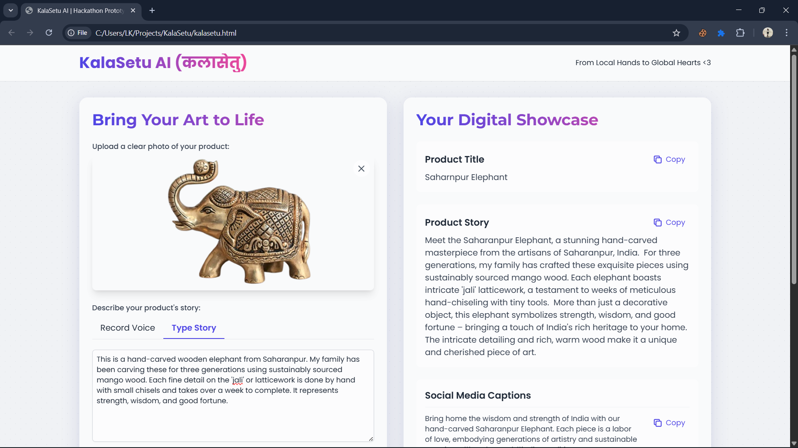
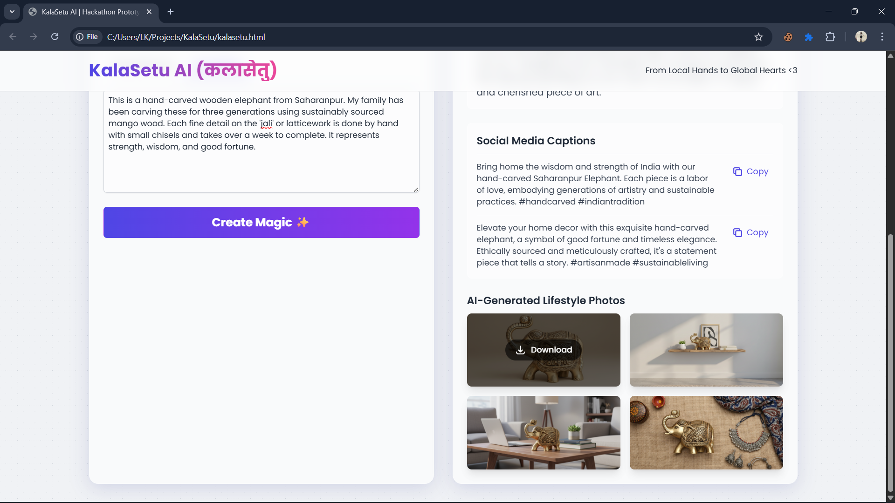

# KalaSetu AI ✨

**KalaSetu AI** is a web tool designed to empower local artisans by generating professional marketing assets using **generative AI**.  
It runs entirely in the browser and enables artisans to create engaging product stories and visuals with ease.  

---

## 📸 Screenshot




---

## 🚀 What It Does
KalaSetu AI allows an artisan to:

- 📤 Upload a **photo** of their product.  
- 📝 Describe the product's **story** by typing or recording voice.  
- 🎨 Generate a complete **marketing kit**, including:
  - A catchy **Product Title**  
  - A compelling **Product Story**  
  - Ready-to-use **Social Media Captions**  
  - AI-generated **lifestyle photos** showcasing the product  

---

## 🌐 Live Link! 

https://kalasetuai.netlify.app//kalasetu.html

---

## 🛠️ Technology Stack
KalaSetu AI is built with a minimal, front-end focused stack:

- **HTML** – Structure & content  
- **Tailwind CSS** – Modern, responsive styling  
- **Vanilla JavaScript** – User interactions & API calls  
- **APIs** – Google Generative AI (Gemini) & Speech-to-Text  

---

## 📥 How to Use
Because this is a single HTML file, setup is very simple:

1. Clone or download this repository.  
2. Open the `index.html` file in your code editor.  
3. Locate the `API_KEY` constant in the `<script>` tag at the bottom of the file:  

   ```js
   const API_KEY = ""; // PASTE YOUR GOOGLE CLOUD API KEY HERE
   ```
4. Paste your Google Cloud API Key inside the quotes.
5. Save the file and open index.html in your web browser. ✅

The application is now ready to use.
